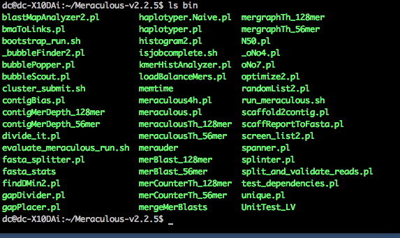
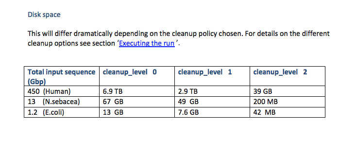
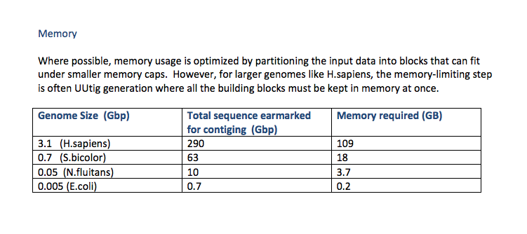
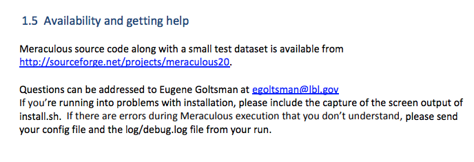
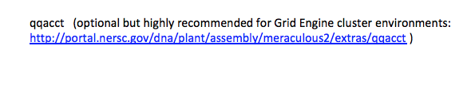
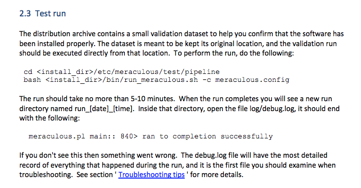
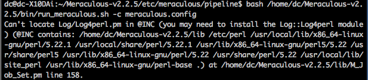
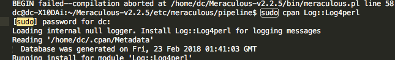
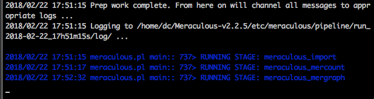

<!DOCTYPE html>
<html>

<h6>meraculousnotes Cuttlefish Assembly</h6>
source: <a href="https://www.melbournebioinformatics.org.au/tutorials/tutorials/assembly/assembly-protocol/">https://www.melbournebioinformatics.org.au/tutorials/tutorials/assembly/assembly-protocol/</a>

<h6>Assembly on cuttlefish</h6>

<li>R1/R2 files are left/right paired end reads. The lengths do not match up like the reference cases</li>
<li>SPAdes for bacteria; not for large genome assy. </li>
<li>Meraculous2 is not clear what the command line arguments should be</li>

<h6>Meraculous2 Prep</h6>

2018/02/22 17:51:15 meraculous.pl main:: 737> RUNNING STAGE: meraculous_import

2018/02/22 17:51:17 meraculous.pl main:: 737> RUNNING STAGE: meraculous_mercount

2018/02/22 17:52:32 meraculous.pl main:: 737> RUNNING STAGE: meraculous_mergraph

2018/02/22 17:54:04 meraculous.pl main:: 737> RUNNING STAGE: meraculous_ufx

2018/02/22 17:54:15 meraculous.pl main:: 737> RUNNING STAGE: meraculous_contigs

2018/02/22 17:54:20 meraculous.pl main:: 737> RUNNING STAGE: meraculous_bubble

2018/02/22 17:55:16 meraculous.pl main:: 737> RUNNING STAGE: meraculous_merblast

2018/02/22 17:55:59 meraculous.pl main:: 737> RUNNING STAGE: meraculous_ono

2018/02/22 17:56:55 meraculous.pl main:: 737> RUNNING STAGE: meraculous_gap_closure

2018/02/22 17:57:14 meraculous.pl main:: 737> RUNNING STAGE: meraculous_final_results

2018/02/22 17:57:14 meraculous.pl main:: 818> RUN COMPLETED SUCCESSFULLY !

2018/02/22 17:57:14 meraculous.pl main:: 828> Total run time: 359.151351 seconds.

2018/02/22 17:57:14 meraculous.pl main:: 830> Thank you for running Meraculous!

</html>
